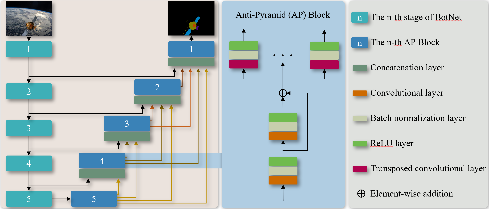

# SPSNet-PyTorch

The official pytorch implementation of **SSP: A Large-Scale Semi-Real Dataset for Semantic Segmentation of Spacecraft Payloads**. 

SPSNet is used for the segmentation of spacecraft payloads which an anti-pyramid-structure decoder. 

We test our code in Python 3.7, CUDA 11.1, cuDNN 8, and PyTorch 1.7.1. We provide `Dockerfile` to build the docker image we used. You can modify the `Dockerfile` as you want.  

<div align=center>

</div>

# Dataset

You can download our release dataset **SSP** from [Here]() with password **ssp1**. The SSP dataset is the first dataset with semi-real images for the segmentation of spacecraft payloads.

# Pretrained weights
The pre-trained weights of SPSNet can be downloaded from [here](https://labsun-me.polyu.edu.hk/zfeng/MAFNet/).

# Usage
* Clone this repo
```
$ git clone https://github.com/Dr-zfeng/SPSNet.git
```
* Build docker image
```
$ cd ~/SPSNet
$ docker build -t docker_image_spsnet .
```
* Download the dataset
```
$ (You should be in the SPSNet folder)
$ mkdir ./dataset
$ cd ./dataset
$ (download our preprocessed dataset.zip in this folder)
$ unzip -d .. dataset.zip
```
* To reproduce our results, you need to download our pre-trained weights.
```
$ (You should be in the SPSNet folder)
$ mkdir ./weights_backup
$ cd ./weights_backup
$ (download our preprocessed weights.zip in this folder)
$ unzip -d .. weights.zip
$ docker run -it --shm-size 8G -p 1234:6006 --name docker_container_spsnet --gpus all -v ~/SPSNet:/workspace docker_image_spsnet
$ (currently, you should be in the docker)
$ cd /workspace
$ python3 run_demo.py
```
The results will be saved in the `./runs` folder.
* To train SPSNet
```
$ (You should be in the SPSNet folder)
$ docker run -it --shm-size 8G -p 1234:6006 --name docker_container_spsnet --gpus all -v ~/SPSNet:/workspace docker_image_spsnet
$ (currently, you should be in the docker)
$ cd /workspace
$ python3 train_student.py
```
* To see the training process
```
$ (fire up another terminal)
$ docker exec -it docker_container_spsnet /bin/bash
$ cd /workspace
$ tensorboard --bind_all --logdir=./runs/tensorboard_log/
$ (fire up your favorite browser with http://localhost:1234, you will see the tensorboard)
```
The results will be saved in the `./runs` folder.
Note: Please change the smoothing factor in the Tensorboard webpage to `0.999`, otherwise, you may not find the patterns from the noisy plots. If you have the error `docker: Error response from daemon: could not select device driver`, please first install [NVIDIA Container Toolkit](https://docs.nvidia.com/datacenter/cloud-native/container-toolkit/install-guide.html) on your computer!

# Citation
If you use SPSNet in your academic work, please cite:
```

```

# Acknowledgement
Some of the codes are borrowed from [MAFNet](https://github.com/lab-sun/MAFNet)

Contact: zfeng94@outlook.com

